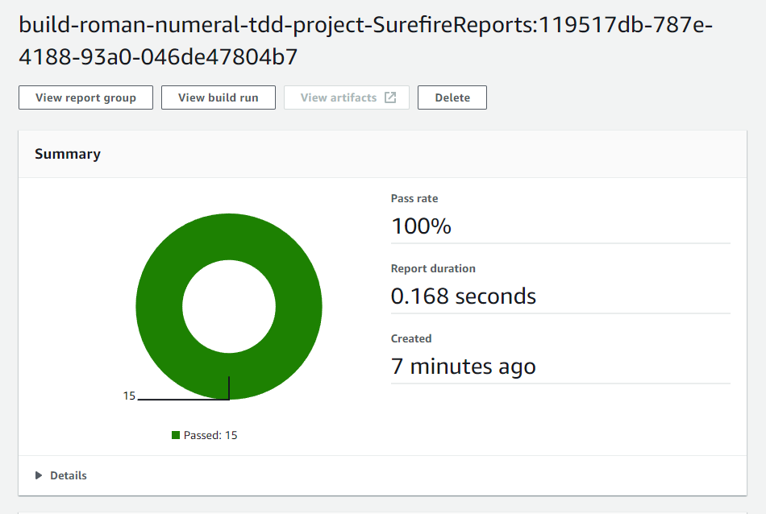

# Roman numeral TDD Excercise
This repository contains my solution for the [Roman numeral exercise](https://github.com/TDD-Katas/roman-numerals#problem-description)

As expected the code has 100% test coverage and every test runs successfully

## Requirements
As opposed to the previous TDD exercises I've done this exercise was short on requirements. It simply had to convert a 
String consisting of roman numerals (I,V,X,L,C,D,M) into their respective numerical values. It was explicitly specified 
the program doesn't need to check for a valid roman numeral. In theory an exception InvalidRomanNumeralException 
would be thrown in this case.


## AWS
I decided to include a buildspec.yml file at the root of this project so it could be built as part of a pipeline using 
AWS pipeline. This is building from a codecommit repo every time a commit is made to master. As no deployment is required
the pipeline only checks outs the code and runs the ```mvn surefire-report:report``` command

Below you can see a snapshot of the surefire report from the latest build:



## Notes
This exercise was actually pretty simple, much more sensible than the previous 'String Calculator' and was easily 
solvable within an hour. Makes you think about data structures (Like using Maps for the numeral character-value mapping)
and can even be done recursively for extra flair. Overall a good interview question.

I started reading and playing around with AWS in early 2020, I thought this project would give me a good excuse to 
create a Pipeline to build and test upon commit, and luckily AWS have made this initial attempt pretty easy. 

I always love finding ways to make the painful parts of development 
easier (hence the interest in TDD). Creating a multi-stage pipeline to build, test and deploy all at the click of a 
button is a really exciting prospect (considering every business I've been in its like NASA mission control). 

